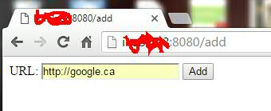
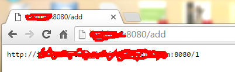
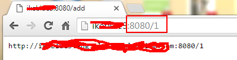
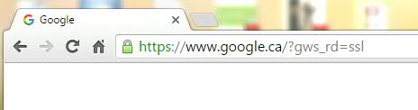

# GotoURL

A URL shortener web application written in golang

## Use Case

### Build
Compile and start server
```
go build
./gotoURL
```

### Add
Go to `<hostname>:8080/add` to submit a URL to be shortened.



And you can retrieve the short url after submission.



### Redirect
Go to `<hostname>:8080/<shorturl>`, and you will be redirected to the correct page.



After hitting `Enter`, you will be redirected to the corresponding page.



## Highlights

1. Synchronized internal map as in memory data structure
2. All the short URLs are persisted
3. Cache process `Put` and persistence process `save` are decoupled by goroutines and channel to enhance concurrency
4. `json` is used instead `gob` to support server failover

## Bonus: Install Go

Check current golang release page for the latest package 
```bash
#Package naming convention: go$VERSION.$OS-$ARCH.tar.gz
wget https://storage.googleapis.com/golang/go1.6.2.linux-amd64.tar.gz
tar -C /usr/local -xzf go1.6.2.linux-amd64.tar.gz
export PATH=$PATH:/usr/local/go/bin
```